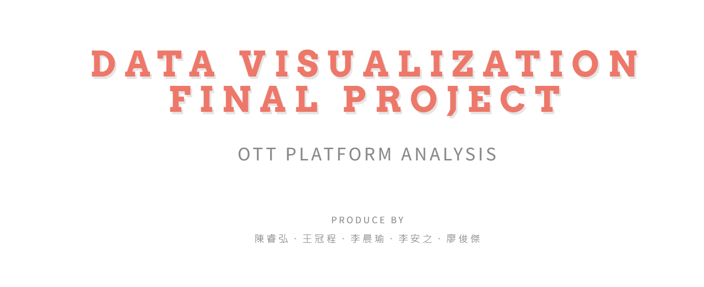

# final_project_datavisualization

## Project Information
- Course Name: Data Visualization
- Assignment Format: Group Project (5-person groups)
- Topic: OTT Platform Analysis

 
    

## Who are we?

我們是來自資管、資工的學生，我們想透過我們原先的背景知識，並且結合課堂所學完成一份資料視覺化的期末專案。  

## Why to Choose this dataset?
經過討論我們決定選擇我們有共興趣的OTT（Over-The-Top）平台，例如Netflix、Disney+、Hulu和Prime。我們將使用的資料集包含了這些平台上可用的電影和電視節目的信息，讓我們比較不同喜好的觀眾應該買哪家OTT平台。

## Divide and Conquer
<table style="margin-top: 5%; margin-left: 2.5%; margin-right: 2.5%; width: 95%;">
	<thead>
		<tr>
			<th colspan="3" style="text-align: center; background-color: #e2ab9c; font-size: larger;">
				Work Contribution
			</th>
		</tr>
	</thead>
	<tbody>
		<tr>
			<td>Student Name</td>
			<td>Student ID</td>
			<td>Contribution</td>
		</tr>
		<tr>
			<td><b>陳睿弘</b></td>
			<td>110403519</td>
			<td>{分工}<td>
		</tr>
		<tr>
			<td>王冠程</td>
			<td>{改學號}</td>
			<td>{分工}</td>
		</tr>
		<tr>
			<td>李晨瑜</td>
			<td>{改學號}</td>
			<td>{分工}</td>
		</tr>
		<tr>
			<td>李安之</td>
			<td>{改學號}</td>
			<td>{分工}</td>
		</tr>
		<tr>
			<td>廖俊傑</td>
			<td>{改學號}</td>
			<td>{分工}</td>
		</tr>
	</tbody>
</table>

## Website Demo 

    

## Contributors
<table>
  <tr>
    <td align="center"><a href="https://github.com/roma0323"> <b>1chooo</b></a> <a href="https://github.com/roma0323" title="Code">💻</a></td>
<!--     <td align="center"><a href="https://github.com/hapiwangy"> <b>hapiwangy</b></a> <a href="https://github.com/hapiwangy/final_project_datavisualization/commits?author=hapiwangy" title="Code">💻</a></td>
    <td align="center"><a href="https://github.com/HapiO3O"> <b>HapiO3O</b></a> <a href="https://github.com/hapiwangy/final_project_datavisualization/commits?author=HapiO3O" title="Code">💻</a></td> -->
  </tr>
</table>
